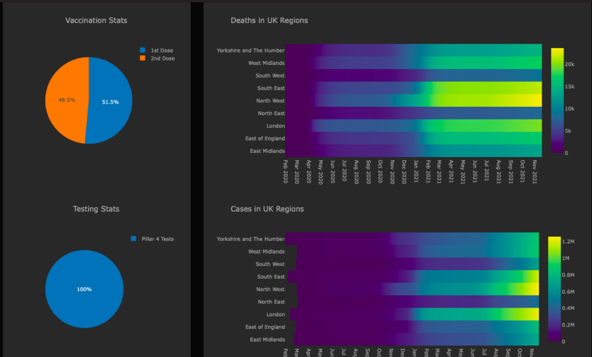
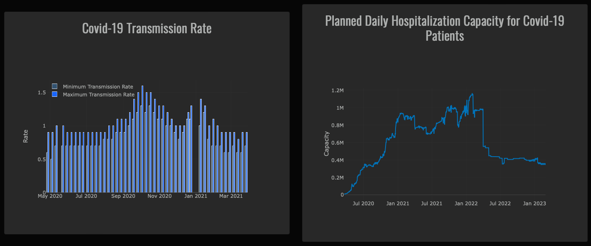

# Data Visualization Project: Interactive Web Portal for Covid-19 Statistics for United Kingdom

# Table of Contents

<!-- list -->

- [Introduction](#introduction)
- [Visualization](#visualization)
- [Dataset](#dataset)
- [HowToRun](#howtorun)
- [Contributors](#contributors)

## Introduction

In this project, We've developed a dashboard using python libraries Plotly Dash which represents the overall situation of Covid-19 in the UK.

## Visualization

 This dashboard consists of
<!-- list -->
1. Global comparisons of deaths and cases due to Covid-19.
2. Headlines regarding Covid-19, scraped from BBC news.
3. Pie Charts showing Vaccination progress in the UK.
4. Heatmaps and Bar charts for the deaths and cases due to Covid-19 with respect to the UK's regions.
5. Bar chart for max and min transmission rate of coronavirus over the year.
6. Daily hospitalization capacity of Covid-19 Patients in the UK.
7. Bar chart representing the number of Mechanical Ventilation beds occupied by Covid-19 patients.
8. Scatter plot showing the daily diagnosed Covid-19 patient with respect to their age bands.
9. Mapbox API for geographically displaying the overall impact of Covid-19 in the UK regions.

# Dataset

 This dashboard represents the visualizations of the UK's Covid-19 data. We have used the UK datasets mainly for two reasons firstly one other group in class is doing the project on same topic and in that case there is high chances overlapping some works. Moreover the UK dataset was easily available through the APIs which can be accessed from the UK's national Covid-19 repository. This web portal also consists of a daily news feature that shows the headlines that are being scraped from the BBC news website. So we downloaded the csv files and used here. These files can be found in data folder.

## HowToRun
To run the code 
<!-- list -->
- Clone this github repository or download the zip file
- Install the dependencies using `pip install -r requirements.txt`
- Run the file `main.py` using `python3 main.py` optional flags to run the file are:
- Example: `python3 main.py`

## Contributions

-[Yash Anand](https://github.com/yashanand1000)
-[Tushar Kumar](https://github.com/Vincit0re)