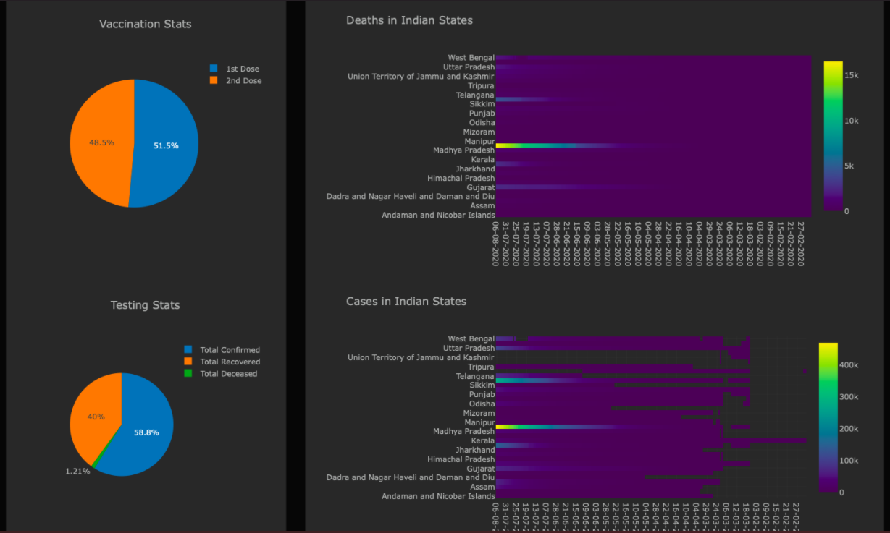

# Data Visualization Project: Interactive Web Portal for Covid-19 Statistics for India [link](https://github.iitj.ac.in/kumar-222/data-visualization-project)

## Table of Contents

<!-- list -->

- [Introduction](#introduction)
- [Visualization](#visualization)
- [Dataset](#dataset)
- [HowToRun](#howtorun)
- [Contributors](#contributors)

## Introduction

In this project, We've developed a dashboard using python libraries Plotly Dash which represents the overall situation of Covid-19 in India.

## Visualization

 This dashboard consists of
<!-- list -->
1. Global comparisons of deaths and cases due to Covid-19.
2. Headlines regarding Covid-19, scraped from BBC news.
3. Pie Charts showing Vaccination progress in the India.
4. Heatmaps and Bar charts for the deaths and cases due to Covid-19 with respect to the different states of India.
5. Bar chart for max and min transmission rate of coronavirus over the year.
6. Daily hospitalization capacity of Covid-19 Patients in the India.
7. Bar chart representing the number of Mechanical Ventilation beds occupied by Covid-19 patients.
8. Scatter plot showing the daily diagnosed Covid-19 patient with respect to their age bands.
9. Mapbox API for geographically displaying the overall impact of Covid-19 in different states of India.

## Dataset

 This dashboard represents the visualizations of the India's Covid-19 data. We have used the this datasets from kaggle website.

## HowToRun
To run the code 
<!-- list -->
- Clone this github repository or download the zip file
- Install the dependencies using `pip install -r requirements.txt`
- Run the file `app.py` using `python3 app.py` optional flags to run the file are:
- Example: `python3 app.py`

## Contributions

-[Yash Anand](https://github.com/yashanand1000)
-[Tushar Kumar](https://github.com/Vincit0re)
